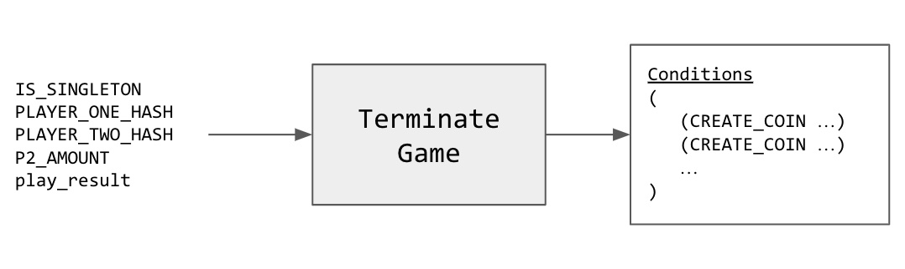

# เกม ทิก-แทก-โท

ในตัวอย่างนี้เราจะมาสร้าง [เกมทิก-แทก-โท](https://en.wikipedia.org/wiki/Tic-tac-toe) บน Chia บล็อกเชนโดยใช้ Coin Set Model และ Chialisp

```
 
         x | o | x             x | o | x 
        ---+---+---           ---+---+---
           | o | x       =>      | o | x 
        ---+---+---           ---+---+---
           |   |               x |   |   

```

## แนวคิดและ Design Patterns

ตัวอย่างนี้คล้ายๆกับ [counter](../counter/README.md) ที่นำแนวคิดและ Design Patterns มาใช้

### 1. [Outer and Inner Puzzles](https://devs.chia.net/guides/chialisp-inner-puzzles/)

> Outer and Inner Puzzle เป็น design pattern ที่ส่งเสริมแนวปฏิบัติการสร้างซอฟต์แวร์ที่ดีเช่น [separation of concerns](https://en.wikipedia.org/wiki/Separation_of_concerns), [composition](https://en.wikipedia.org/wiki/Object_composition), and [unit testings](https://en.wikipedia.org/wiki/Unit_testing)

> งานของ [singleton top layer puzzle](https://github.com/kimsk/chia-concepts/blob/main/notebooks/intermediate/singleton/notebook.ipynb) คือการควบคุม[กฎของ singleton](https://chialisp.com/singletons#design-decisions) เท่านั้น ในขณะที่ [tic tac toe coin puzzle](https://github.com/kimsk/chia-concepts/blob/main/notebooks/misc/tic-tac-toe/code/coin.clsp) ไม่จำเป็นต้องรู้ด้วยว่าตัวมันเองถูกใช้ใน singlton top layer puzzle อีกที

> [tic tac toe puzzle](https://github.com/kimsk/chia-concepts/blob/main/notebooks/misc/tic-tac-toe/code/tic-tac-toe.clsp) ไม่จำเป็นต้องรู้ว่ากำลังถูกใช้โดย puzzle อื่นหรือกำงานด้วยตัวมันเอง

> เราสามารถเลือกใช้ [terminate game puzzle](https://github.com/kimsk/chia-concepts/blob/main/notebooks/misc/tic-tac-toe/code/terminate-game.clsp) ให้เหมาะกับสถานการ์ณ เช่น ถ้าเราต้องการใช้ [tic tac toe coin puzzle](https://github.com/kimsk/chia-concepts/blob/main/notebooks/misc/tic-tac-toe/code/coin.clsp) กับ [singleton top layer puzzle](https://github.com/Chia-Network/chia-blockchain/blob/main/chia/wallet/puzzles/singleton_top_layer_v1_1.clvm#L55) เราจำเป็นต้องใช้ terminate game puzzle ที่สามารถสร้าง `CREATE_COIN 0x... -113` เพื่อที่จะหลอมเหรียญ singleton 

> แนวคิดนี้มีพื้นฐานเดียวกันกับ [Dependency injection design pattern](https://en.wikipedia.org/wiki/Dependency_injection)

```
    +---------------------+
    | singleton top layer |
    |-+-------------------+
    | | tic tac toe coin  |
    | |-+-----------------+
    | | | tic tac toe     |
    | | | terminate game  |
    +---------------------+
```


### 2. [Currying](https://devs.chia.net/guides/chialisp-currying)

#### Pre-commit Environment and Store State
> เราสามารถปรับเปลี่ยน puzzle ให้เหมาะกับสถานการณ์ต่างๆกันไปโดยใช้ Currying

> Chialisp เป็น pure functional programming language ซึ่งหมายความว่าโปรแกรมที่เขียนโดย Chialisp จะทำงานกับค่าที่ถูกส่งเข้ามาในฟังก์ชั่นโดยตรง 

> ในเกม ทิก-แทก-โท เราเก็บบอร์ดและตาที่จะเล่น (`x` หรือ `o`) ลงใน puzzle โดยใช้ currying เพราะฉะนั้นการรันโปรแกรมเราแค่ผ่านตำแหน่งที่ต้องการเท่านั้น

```lisp
;   BOARD : current tic tac toe board state (curried)
;   V     : x or o to be played (curried)
;   pos   : position to be played
(mod (BOARD V pos)
    (include tic-tac-toe.clib)

    (defun play (new_board V)
        (list 
            (check-board new_board V)
            new_board
        )
    )

    ; 1. get new board
    ; 2. return the play result and new board
    (play (get-new-board BOARD V pos) V)
)
```

> หลังจากที่ curry ค่าที่ต้องการเราสามารถนำ puzzle ไป curry ต่อ และคำนวณ puzzle hash สำหรับเหรียญใหม่ได้ดังนี้

```lisp
(create-new-coin
    ; puzzle_hash
    (sha256tree
        (curry
            MOD
            (list
                MOD
                TERMINATE_PUZZLE
                (list PLAYER_ONE_PK PLAYER_ONE_HASH)
                (list PLAYER_TWO_PK PLAYER_TWO_HASH)
                (curry
                    tic_tac_toe_puzzle 
                    (list 
                        next_board
                        next_player
                    )
                )
                AMOUNT
            )
        )
    )
    AMOUNT
)
```

### 3. [Storing and Retrieving State](https://developers.chia.net/t/can-you-store-state-on-the-network/84)

> เราสามารถดึงค่าที่ curried ใน puzzle (`puzzle_reveal` เมื่อเหรียญถูกใช้จะถูกเก็บในบล็อกเชน) ออกมาดูได้ 

```lisp
(defun-inline get-player-from-curried-tic-tac-toe-puzzle (curried_puzzle)
    (r (f (r (f (r (r (f (r (r curried_puzzle)))))))))
)
```

``` python
def get_curried_puzzle_from_curried_coin_puzzle(curried_coin_puzzle):
    return curried_coin_puzzle.at("rrfrrfrrfrrfrrfrfr")

def get_board_from_curried_puzzle(curried_puzzle):
    board_from_puzzle = curried_puzzle.at("rrfrfr").as_atom_list()
    board_from_puzzle = list(
        map(lambda b: int.from_bytes(b, "little"), board_from_puzzle)
    )
    return board_from_puzzle

def get_player_from_curried_puzzle(curried_puzzle):
    player = curried_puzzle.at("rrfrrfrfr").as_int()
    return chr(player)
```

### 4. [Aggregated Signature](https://devs.chia.net/guides/chialisp-bls-signatures) (`AGG_SIG_ME`)

> เหรียญเกม ทิก-แทก-โท ถูกสร้างครั้งแรกโดยเหรียญจากผู้เล่นสองคน 

> ทั้งสองเหรียญจะถูกใช้ใน spend bundle เดียวกันเพื่อสร้างเหรียญเกม

> ลายเซ็นของผู้เล่นแต่ละคนจะถูกจับรวมใส่ไว้ใน spend bundle

```python
coin_message = (
    std_hash(int_to_bytes(position))
    + tic_tac_toe_coin.name()
    + DEFAULT_CONSTANTS.AGG_SIG_ME_ADDITIONAL_DATA
)

# sign with sk
signature: G2Element = AugSchemeMPL.sign(
    sk,
    coin_message
)

coin_spend = CoinSpend(
    tic_tac_toe_coin,
    curried_coin_puzzle,
    Program.to([position]) # position
)

# aggregate alice and bob's signatures
agg_sig = AugSchemeMPL.aggregate([alice_signature, bob_signature])
```

### 5. [Spend Bundles](https://docs.chia.net/spend-bundles)
```python
spend_bundle = SpendBundle(
    [alice_coin_spend, bob_coin_spend], # coin spends
    agg_sig # aggregated signature
)
```


### 6. [Singleton](https://chialisp.com/singletons)
- [notebook](https://github.com/kimsk/chia-concepts/blob/main/notebooks/intermediate/singleton/notebook.ipynb)
- [singleton_top_layer_v1_1.clvm](https://github.com/Chia-Network/chia-blockchain/blob/main/chia/wallet/puzzles/singleton_top_layer_v1_1.clvm)
- [singleton_top_layer_v1_1.py](https://github.com/Chia-Network/chia-blockchain/blob/main/chia/wallet/puzzles/singleton_top_layer_v1_1.py)

> Singleton เป็น design pattern ที่ทำให้เราสร้างเหรียญและ puzzle ในระบบ coin set model ที่สนับสนุน unique identifier (launcher id)

> เราสามารถเข้าถึง puzzle ของเกมที่เราต้องการได้โดยใช้ unique id

> Singleton puzzle การันตีว่ามีเหรียญเดียวเท่านั้นบนบล็อกเชนที่เป็นตัวแทนเกม ทิก-แทก-โท ของเรา 


## Code
- [tic-tac-toe.clib](./code/tic-tac-toe.clib)
- [tic-tac-toe.clsp](./code/tic-tac-toe.clsp)
- [tic_tac_toe.py](./code/tic_tac_toe.py)


- [terminate-game.clsp](./code/terminate-game.clsp)


- [coin.clsp](./code/coin.clsp)


### Helpers Code
- [utils.py](../../../shared/utils.py)
- [utils.clib](../../../shared/utils.clib)
- [singleton_utils.py](../../../shared/singleton_utils.py)

## Notebooks
> Each notebooks show how each puzzle work.

1. [tic tac toe](tic-tac-toe.ipynb)
2. [terminate game](terminate-game.ipynb)
3. [tic tac toe coin](coin.ipynb)
4. [tic tac toe coin - blockchain simulator](coin-sim.ipynb)
5. [singleton tic tac toe](singleton.ipynb)