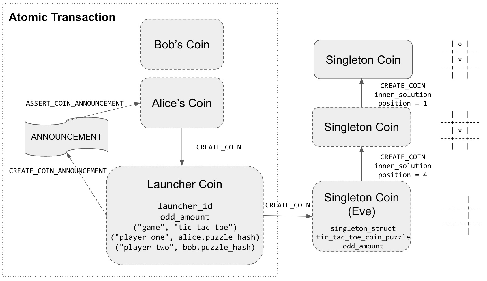

- [在Chia上的井字小游戏](https://mp.weixin.qq.com/s/-lFA40OUjC3AtKHbjcjZcw)
- [เกม ทิก-แทก-โท](README-th.md)

# Tic Tac Toe

In this example, we show how to implement a simple [Tic Tac Toe](https://en.wikipedia.org/wiki/Tic-tac-toe) game in a coin set model with Chialisp on Chia Blockchain.

```
 
         x | o | x             x | o | x 
        ---+---+---           ---+---+---
           | o | x       =>      | o | x 
        ---+---+---           ---+---+---
           |   |               x |   |   

```
## Chia Concepts and Design Patterns
Like the [counter](../counter/README.md) example, this example demonstrates the following Chia concepts and design patterns:

### 1. [Outer and Inner Puzzles](https://devs.chia.net/guides/chialisp-inner-puzzles/)

> Outer and Inner Puzzle is a very powerful design pattern as it promotes good software engineering practices such as [separation of concerns](https://en.wikipedia.org/wiki/Separation_of_concerns), [composition](https://en.wikipedia.org/wiki/Object_composition), and [unit testings](https://en.wikipedia.org/wiki/Unit_testing). 

> For example, [singleton top layer puzzle](https://github.com/kimsk/chia-concepts/blob/main/notebooks/intermediate/singleton/notebook.ipynb) only concerns about maintaining [singleton rules](https://chialisp.com/singletons#design-decisions) while the [tic tac toe coin puzzle](https://github.com/kimsk/chia-concepts/blob/main/notebooks/misc/tic-tac-toe/code/coin.clsp) doesn't need to know if it's wrapped inside the singleton top layer or not. 

> The [tic tac toe puzzle](https://github.com/kimsk/chia-concepts/blob/main/notebooks/misc/tic-tac-toe/code/tic-tac-toe.clsp) doesn't need to know if it's stand alone puzzle or if it's wrapped inside any puzzle.

> We inject different [terminate game puzzle](https://github.com/kimsk/chia-concepts/blob/main/notebooks/misc/tic-tac-toe/code/terminate-game.clsp) to control how tic tac toe coin output the conditions. For example, the [tic tac toe coin](https://github.com/kimsk/chia-concepts/blob/main/notebooks/misc/tic-tac-toe/code/coin.clsp) that will be wrapped inside the [singleton top layer puzzle](https://github.com/Chia-Network/chia-blockchain/blob/main/chia/wallet/puzzles/singleton_top_layer_v1_1.clvm#L55) require `CREATE_COIN 0x... -113` to melt the singleton coin.

> This is also similar to [Dependency injection design pattern](https://en.wikipedia.org/wiki/Dependency_injection). 

```
    +---------------------+
    | singleton top layer |
    |-+-------------------+
    | | tic tac toe coin  |
    | |-+-----------------+
    | | | tic tac toe     |
    | | | terminate game  |
    +---------------------+
```


### 2. [Currying](https://devs.chia.net/guides/chialisp-currying)

#### Pre-commit Environment and Store State
> Currying allows us to customize the puzzle to be reused in different siutation.

> Since Chialisp is a pure functional programming language, it only relies on input for its environment. 

> Current board and next player (`x` or `o`) are curried in as a current state and playing the game only requires position.

```lisp
;   BOARD : current tic tac toe board state (curried)
;   V     : x or o to be played (curried)
;   pos   : position to be played
(mod (BOARD V pos)
    (include tic-tac-toe.clib)

    (defun play (new_board V)
        (list 
            (check-board new_board V)
            new_board
        )
    )

    ; 1. get new board
    ; 2. return the play result and new board
    (play (get-new-board BOARD V pos) V)
)
```

> We can also curry the curried puzzle to create a next puzzle and calculate its puzzle hash. 

```lisp
(create-new-coin
    ; puzzle_hash
    (sha256tree
        (curry
            MOD
            (list
                MOD
                TERMINATE_PUZZLE
                (list PLAYER_ONE_PK PLAYER_ONE_HASH)
                (list PLAYER_TWO_PK PLAYER_TWO_HASH)
                (curry
                    tic_tac_toe_puzzle 
                    (list 
                        next_board
                        next_player
                    )
                )
                AMOUNT
            )
        )
    )
    AMOUNT
)
```
### 3. [Storing and Retrieving State](https://developers.chia.net/t/can-you-store-state-on-the-network/84)

> From the curried puzzle (`puzzle_reveal` is available on blockchain once the coin is spent), we could extract the curried values representing state that we want.

```lisp
(defun-inline get-player-from-curried-tic-tac-toe-puzzle (curried_puzzle)
    (r (f (r (f (r (r (f (r (r curried_puzzle)))))))))
)
```

``` python
def get_curried_puzzle_from_curried_coin_puzzle(curried_coin_puzzle):
    return curried_coin_puzzle.at("rrfrrfrrfrrfrrfrfr")

def get_board_from_curried_puzzle(curried_puzzle):
    board_from_puzzle = curried_puzzle.at("rrfrfr").as_atom_list()
    board_from_puzzle = list(
        map(lambda b: int.from_bytes(b, "little"), board_from_puzzle)
    )
    return board_from_puzzle

def get_player_from_curried_puzzle(curried_puzzle):
    player = curried_puzzle.at("rrfrrfrfr").as_int()
    return chr(player)
```
### 4. [Aggregated Signature](https://devs.chia.net/guides/chialisp-bls-signatures) (`AGG_SIG_ME`)

> To create a two player game, we want two players to spend their standard coins to create one tic tac toe coin.

> Both coins have to be spent at the same time, so we put them in one spend bundle.

> Each player can provide his/her signature to allow their coins to be spent, and we can aggregate them into the spend bundle.

```python
coin_message = (
    std_hash(int_to_bytes(position))
    + tic_tac_toe_coin.name()
    + DEFAULT_CONSTANTS.AGG_SIG_ME_ADDITIONAL_DATA
)

# sign with sk
signature: G2Element = AugSchemeMPL.sign(
    sk,
    coin_message
)

coin_spend = CoinSpend(
    tic_tac_toe_coin,
    curried_coin_puzzle,
    Program.to([position]) # position
)

# aggregate alice and bob's signatures
agg_sig = AugSchemeMPL.aggregate([alice_signature, bob_signature])
```

### 5. [Spend Bundles](https://docs.chia.net/spend-bundles)
```python
spend_bundle = SpendBundle(
    [alice_coin_spend, bob_coin_spend], # coin spends
    agg_sig # aggregated signature
)
```


### 6. [Singleton](https://chialisp.com/singletons)
- [notebook](https://github.com/kimsk/chia-concepts/blob/main/notebooks/intermediate/singleton/notebook.ipynb)
- [singleton_top_layer_v1_1.clvm](https://github.com/Chia-Network/chia-blockchain/blob/main/chia/wallet/puzzles/singleton_top_layer_v1_1.clvm)
- [singleton_top_layer_v1_1.py](https://github.com/Chia-Network/chia-blockchain/blob/main/chia/wallet/puzzles/singleton_top_layer_v1_1.py)

> Singleton is another important design pattern allowing coin set model to implement a coin and puzzle with unique identifier (launcher id). 

> The unique id allows us to access the on-going game (stored in coin).

> The singleton puzzle guarantees that there is only one valid coin representing the individual game.




## Code
- [tic-tac-toe.clib](./code/tic-tac-toe.clib)
- [tic-tac-toe.clsp](./code/tic-tac-toe.clsp)
- [tic_tac_toe.py](./code/tic_tac_toe.py)


- [terminate-game.clsp](./code/terminate-game.clsp)


- [coin.clsp](./code/coin.clsp)


### Helpers Code
- [utils.py](../../../shared/utils.py)
- [utils.clib](../../../shared/utils.clib)
- [singleton_utils.py](../../../shared/singleton_utils.py)

## Notebooks
> Each notebooks show how each puzzle work.

1. [tic tac toe](tic-tac-toe.ipynb)
2. [terminate game](terminate-game.ipynb)
3. [tic tac toe coin](coin.ipynb)
4. [tic tac toe coin - blockchain simulator](coin-sim.ipynb)
5. [singleton tic tac toe](singleton.ipynb)
