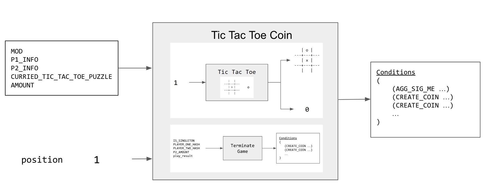
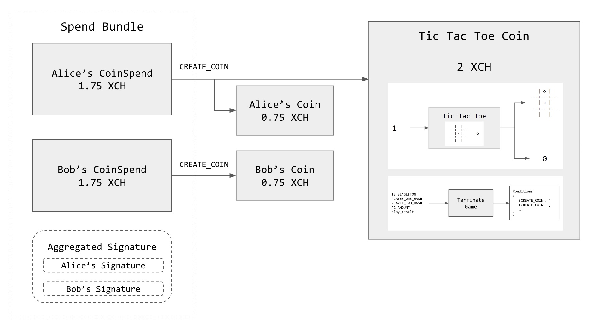
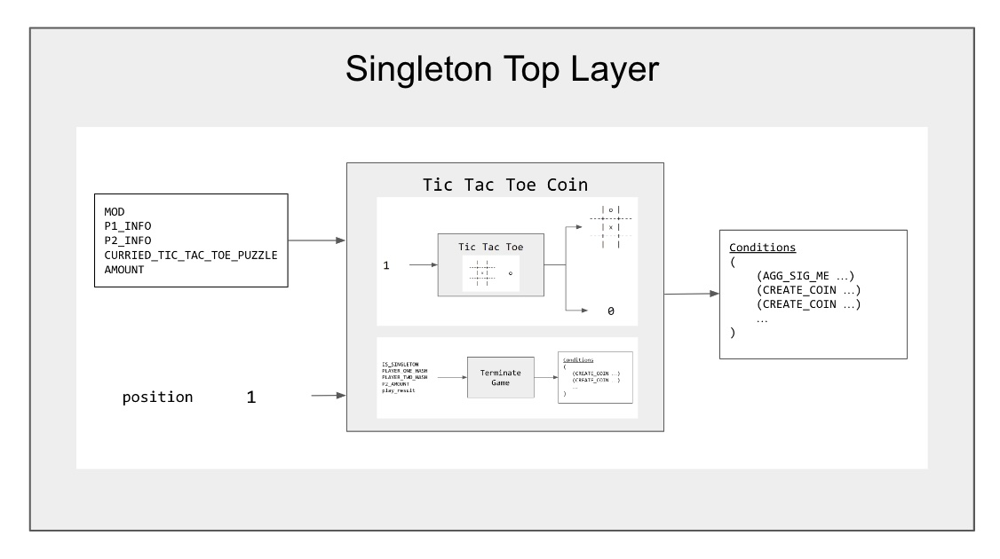

# Tic Tac Toe

In this example, we show how to implement a simple [Tic Tac Toe](https://en.wikipedia.org/wiki/Tic-tac-toe) game in a coin set model with Chialisp on Chia Blockchain.

## Chia Concepts and Design Patterns
Like the [counter](../counter/README.md) example, this exmple demostrates the following Chia concepts and design patterns:

1. [Outer and Inner puzzles](https://chialisp.com/docs/common_functions#outer-and-inner-puzzles)
2. [Currying](https://chialisp.com/docs/common_functions#currying)
3. [Singleton](https://chialisp.com/docs/puzzles/singletons)
    - [notebook](https://github.com/kimsk/chia-concepts/blob/main/notebooks/intermediate/singleton/notebook.ipynb)
    - [singleton_top_layer_v1_1.clvm](https://github.com/Chia-Network/chia-blockchain/blob/main/chia/wallet/puzzles/singleton_top_layer_v1_1.clvm)
    - [singleton_top_layer_v1_1.py](https://github.com/Chia-Network/chia-blockchain/blob/main/chia/wallet/puzzles/singleton_top_layer_v1_1.py)
4. [Storing State](https://developers.chia.net/t/can-you-store-state-on-the-network/84)
    - Deriving current state from previous coin spend

In additions, as the game requires two players taking turn playing the game, only one player at a time can spend the tic-tac-toe singleton coin. We will utilize [aggregated signature and assertion](https://chialisp.com/docs/security#signing-and-asserting-solution-truth) to prevent unauthorized user to tamper the game state.

We also need a way for two players to set up the game and place a wager in trustless manner. `ASSERT_ANNOUNCEMENT` and `ASSERT_*_RELATIVE` 

Finally, depending on how the game end, the wager has to be distributed fairly.

## Notebooks
### [tic tac toe](tic-tac-toe.ipynb)

### [terminate game](terminate-game.ipynb)

### [tic tac toe coin](coin.ipynb)
### [tic tac toe coin - blockchain simulator](coin-sim.ipynb)

### [singleton tic tac toe](singleton-tic-tac-toe.ipynb)
